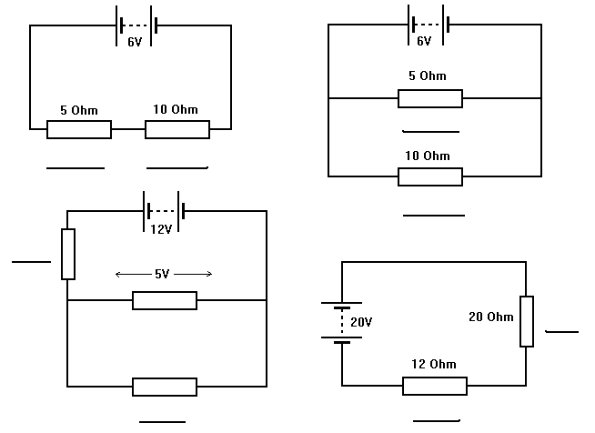
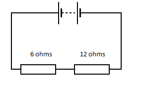
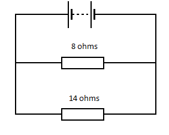
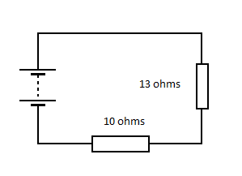
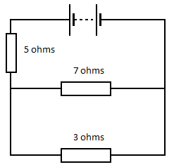

1. Copy each of the following circuits and fill in the spaces with the potential difference across the nearby resistor.
	

1. A six volt cell is connected in series with a 3 ohm resistor. What current will flow and if the circuit is switched on for 3 mins how much charge flows through and how much energy is dissipated in the resistor?

1. In each of the following circuits the two resistors could be replaced by a single resistor. What would the value of this single resistor be? (Show your working for this question).

	1. 	
	1. 
	1. 

1. In this circuit all three of the resistors could be replaced by a single resistor; what would its value be?
	
