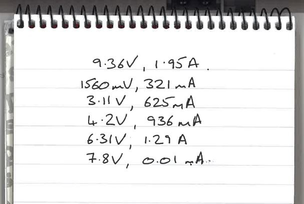

1. A cell delivers a potential difference of 1.5 V to a charge of 600 mC.  How much energy is transferred?

1. A light bulb is connected to a 12 V power supply and draws a current of 3.33 A.  It is left on for two minutes	
	1. How much charge is transferred?
	1. How much energy does the power supply transfer to the lamp?

1. An electric heater running on a 240 V supply transfers 150 kJ of energy in one minute.
	1. How much charge flows around the circuit in this minute?
	1. What is the average current in the circuit?

1. A resistor is placed in a circuit with a cell and the current measured with a voltmeter and ammeter.

	1. Draw such a circuit.
	The number of cells is increased and the voltage and current are measured.  Below is a copy of the piece of paper with the student's results.  
    
    1. Put the data collected into a proper table and then plot a graph of V against I.
    2. Do you think any of the data are anomalies.  What do you think could have happened?
    2. Explain whether the resistor obeys Ohm's law.
    3. By taking a reading of V and I *off the best fit line*, calculate the resistance of the resistor.
