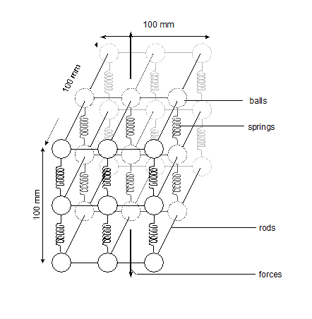
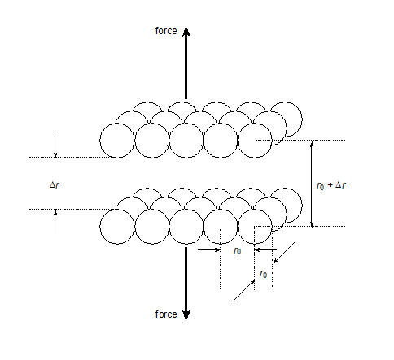

1. A school laboratory has a demonstration model, which is meant to illustrate the stretching of bonds between atoms as a piece of material is stretched. The model has three horizontal planes of small balls linked horizontally by rods and vertically by springs. There are nine balls in each horizontal layer. All the springs are identical and may be taken to be 50 mm long. The dimensions are shown, all in millimetres. When a vertical stretching force of 18 N is applied, the height of 100 mm increases to 110 mm.

    

    1. What is the restoring force for the 10% strain for a single spring?
    1. What is the force constant (restoring force per unit extension) for a single spring?
    Now you are ready to make a link between the Young modulus of a metal (stress / strain) and the springiness of bonds between individual atoms.  Imagine layers of atoms in a square array, each atom at a distance r0  from its nearest neighbour in each direction.
    
    Suppose a wire with many such layers is stretched a little so that each layer is now r0 + &Delta;r  from those above or below it.
    1. If there are n gaps between layers in the length of the wire, how long is the wire before it is stretched?
    1. By how much has the wire extended?
    1. What is the strain in terms of r0 and &Delta;r ?
    Now think of the bond holding each atom as being like a spring, so that there is a force of k &Delta;r  pulling a pair of atoms together.
    1. k is the stiffness of the spring. What are the units of k?
    1. There are m atoms in each layer. What is the force pulling adjacent layers together?
    1. The stress is the force per unit area. In terms of the spacing r0 , how many atoms are there per square metre of a layer?
    1. What is the stress in terms of k, r0 and &Delta;r ?
    1. What is the Young modulus in terms of k , r0?
    1. For steel, the Young modulus is 2 x 1011 Pa. The atomic spacing is about 3 x 10–10 m. What is the stiffness of the interatomic bond?

1. A cylindrical copper wire and a cylindrical steel wire, each of length 1.000 m and having equal diameters are joined to form a composite wire 2.000 m long.  This composite wire is subjected to a tensile stress until its length becomes 2.002 m. Calculate the stress applied to the wire. (The Young modulus of copper is 1.2 x 1011 Pa and the Young modulus of steel is 2.0 x 1011 

1. A submerged wreck is lifted clear of a dock basin by means of a crane to which is attached a steel cable 10m long of cross-sectional area 5 cm2 and a Young's modulus of 5 x 1010 N m-2.  The material being lifted has a mass of 104 kg and a density of 8000 kg m-3.  Find the change in the extension of the cable as the load is lifted clear of the water.  Assume at all times that the tension in the cable is the same throughout its length.
