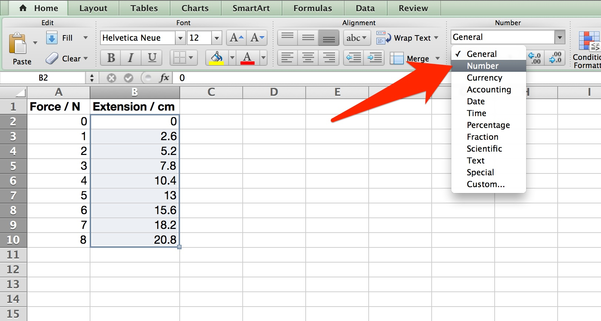
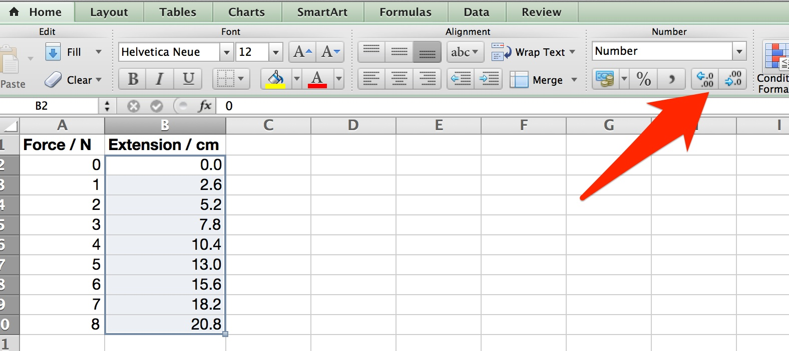
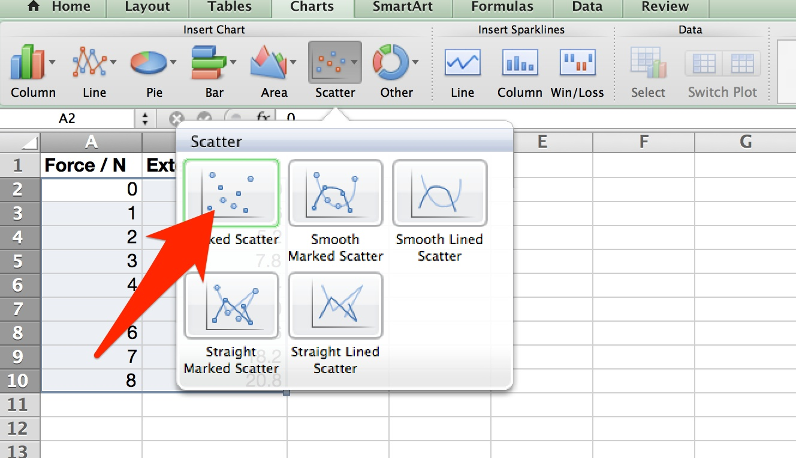
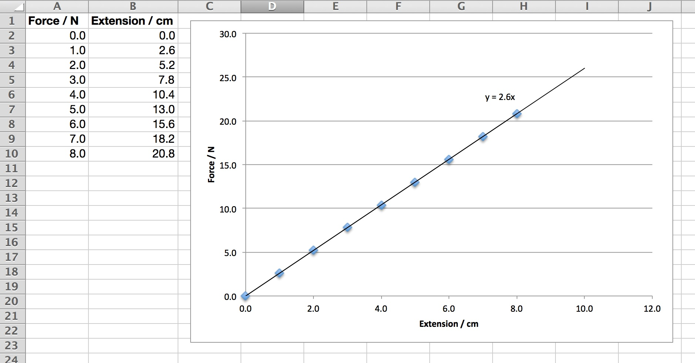

## Introduction

In theory Excel should be the perfect environment for producing well formatted tables and graphs of experiments.  However, in practice it is does require some work and initially it is very easy to produce poorly formatted tables and graphs using Excel.

For this tutorial we are going to use data from an experiment to test Hooke\'s Law, $$ F = kx $$.  Some sample experimental data is provided (copy and paste into Excel) or you can use your own.

<table class="table table-bordered" style="width:350px">
	<tr><th>Force</th><th>Extension</th></tr>
	<tr><td>0</td><td>0</td></tr>
	<tr><td>1</td><td>2.6</td></tr>
	<tr><td>2</td><td>5.2</td></tr>
	<tr><td>3</td><td>7.8</td></tr>
	<tr><td>4</td><td>10.4</td></tr>
	<tr><td>5</td><td>13</td></tr>
	<tr><td>6</td><td>15.6</td></tr>
	<tr><td>7</td><td>18.2</td></tr>
	<tr><td>8</td><td>20.8</td></tr>
</table>

## Formatting the table

The copied table has a number of key flaws which need to be addressed:

The first thing missing from the table are the units.  In all tables the headings should include the **quantity** measured and the **units** measured.  No units should appear in the table itself.

The second error in the table is the lack of consistency in the number of decimal places.  All measured values should be to a consistent number of decimal places.  The number of decimal places is usually determined by the resolution of the measuring instrument.  There are exceptions to this however, for example when a value on a digital meter fluctuates on the last digit or a large source of random error is introduced such as hand timing using a digital stopclock.

This inconsistency can be repaired by changing the format to \'number\' in Excel and then adjusting the number of decimal places.  This can be done using the ribbon as follows:

1. Highlight the column of the table you want to adjust.  
2. Now click the format drop-down in central part of the 'Home' ribbon and choose 'number' as the format.  
   
      

4. Once this is done the number of decimal places can be increased or decreased using the two adjustment buttons. 
   
      

5. Use this technique to adjust the two columns to match the precision of the measurements.

The final table is now nicely formatted.

## Creating a graph

Excel calls a scientific graph a *scatter chart*.  This can be inserted by using the 'Charts' part of the ribbon.

**Conventions for plotting points**

Throughout this course I will be using points to represent individual data points and lines to represent our physical models.  A linear best fit line is the simplest example of a model physics and by adding a best fit line to out data points we are both fitting a model to the data and gaining a representation of the fit of the model to the data.  Remember, the points represent real data and the line represents our idea of what is happening.

A basic graph is inserted by highlighting your data and choosing the *Chart* part of the ribbon and choosing the scatter chart with individual data points. (Called "Marked Scatter" in some versions of Excel.)

You will then have a simple graph on the page in front of you.

## Formatting the graph

The graph in front of you will not yet be ready for publication - it requires formatting properly.  In order to achieve this click on the *Chart Layout* part of the ribbon.  You can now add a Title, Axis labels (include units) etc.  I suggest you remove the Legend in this case as there is only one set of data points.

A best fit line can also be added at this stage.  Excel calls such a thing a *Trendline* and can be added from the ribbon, or by right-clicking on the graph.  Once the trendline is displayed a right-click allows you to access the options where you can choose to display the equation on the graph.

## Finished

The table & graph should now look like this:

