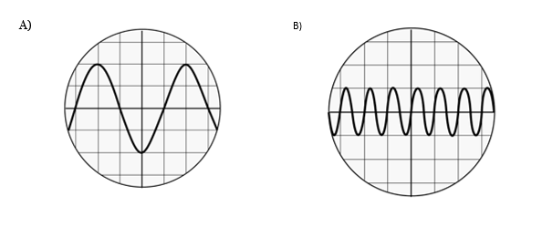
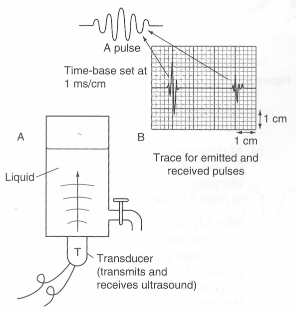

1. Complete these diagrams. In each case add three more waves: one being reflected and two after reflection. Indicate with dotted arrows their direction of travel.
	

2. Sound travels at 330m/s in air, and 1500m/s in water. A sound wave of frequency 800Hz is created by a loud speaker in air. 
	1. What wavelength is this sound?
	3. The sound wave then passes into water. What will the new frequency and wavelength be? 

1. Below are shown two oscilloscope traces, A and B.  
	
	1. If the time base on the oscilloscopeis are quoted as 1 ms / division, calculate the time period and frequency of wave A.
	2. The sound is then changed and recorded on oscilloscope B.  Describe how the sound has changed.  Be as quantitative [^1] as possible.

1. The depth of a liquid in an industrial container can be checked using ultrasound (see below).  Some of the ultrasound emitted by the transducer is reflected back from the surface.
	
	1. What is the difference between ultrasound and normal sound? 
	1. Compare the second pulse to the first pulse using scientific terminology.
	1. Work out the time between the two pulses
	1. If the speed of ultrasound in water is 1500 m/s, calculate the depth of the container.

[^1]: using numbers!
