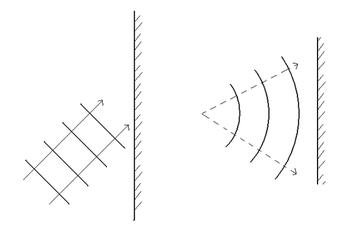

1. Complete these diagrams. In each case add three more waves: one being reflected and two after reflection. Indicate with dotted arrows their direction of travel.
	

2. Sound travels at 330m/s in air, and 1500m/s in water. A sound wave of frequency 800Hz is created by a loud speaker in air. What wavelength is this sound?

3. The sound wave then passes into water. What will the new frequency and wavelength be? 
