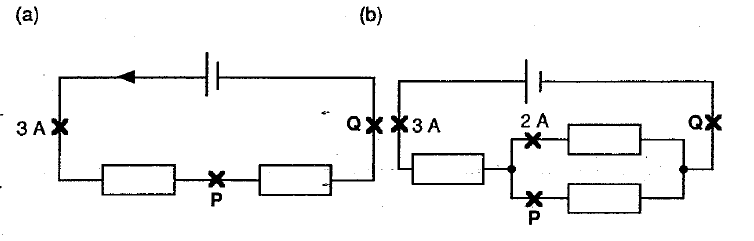
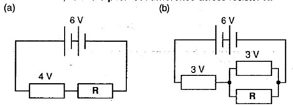
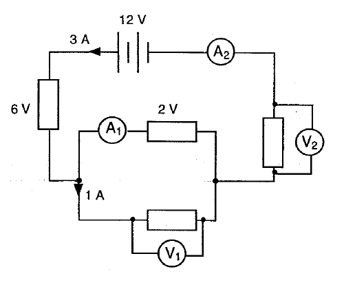

# Electricity 1

1. Explain why metals are good conductors of electricity

1. Give the S.I. units for time, electrical current and charge.

1. How much charge is passed by a lamp drawing 2A for 3 minutes?

1. How much current is required to transfer 1 kC in one 1 hour?

1. 
	1. Draw a circuit containing a cell, an ammeter and a resistor.
	1. Add a voltmeter to the circuit to measure the potential difference across the cell.

1. In the circuits below, find the current at points **P** and **Q**
	

1. In the circuit below, calculate the potential difference across resistor **R**.
	

1. In the circuit below, what are the readings on the ammeters and voltmeters?
	