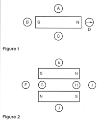
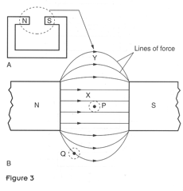

1. The two figures below show bar magnets surrounded by plotting compasses A-J.  Copy the figures and fill in the orientations of the plotting compasses.
    

1. Figure 3 shows a horseshoe magnet.
    
    1. What does it mean to say the field is *uniform*?
    1. Which part of the magnet, *X* or *Y*, has a uniform field?  How can you tell?

1. There are three types of magnetic material: ferromagnetic, diamagnetic and paramagnetic.  For each type research what this means and give examples of a material with these properties.
