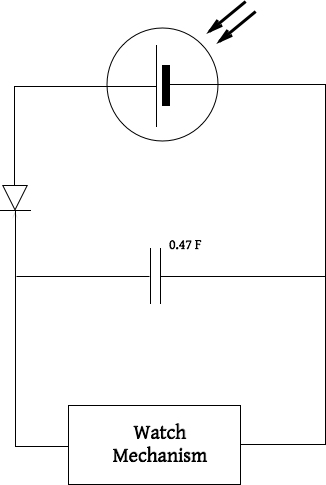
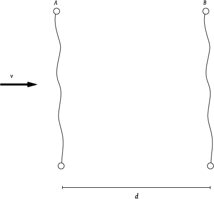

1. A capacitor of capacitance 22 &micro;F is charged by connecting it to a 400 V supply, and is then discharged.
	1. Calculate the energy transferred during the discharge.
	1. If the discharge takes 10 &micro;s, what is the average power of the discharge?

1. Capacitors of high capacitance can be used to provide a back-up energy source for a solar-powered watch.  The basic circuit is shown in the diagram.
	
	1. In direct sunlight the solar cell powers the watch and charges the capacitor to a p.d. of 2.3 V.  Calculate: **(i)** the charge **(ii)** the energy stored on the capacitor.
	1. In darkness, the p.d. produced by the solar cell drops to zero and the capacitor takes over as the power supply.  Calculate the charge that will have flowed through the watch mechanism as the p.d. across the capacitor falls to 1.0 V. (The watch will cease to function if the p.d. is below 1.0 V)
	1. As the p.d. falls from 2.3 V to 1.0 V, the watch draws a *constant* current of 1.0 &micro;A from the capacitor. **(i)** For how long, in hours, can the back-up capacitor run the watch? **(ii)** What average power does it deliver to the watch during this back-up period?

1. A 47 &micro;F capacitor is charged to 6.0 V then discharged through a 1.0 M&Omega; resistor.
	1. What is the initial charge stored on the capacitor?
	1. Calculate the initial current and hence find the time *td* the capacitor would take to discharge fully if this discharging current were to remain constant.
	1. Calculate the time constant, *RC*, for this circuit.
	1. The current through the circuit is measured with an ammeter which will read zero for currents below 1 &micro;A.  Calculate the time taken for the ammeter to read zero.

1. A capacitor of capacitance 22 &micro;F is charged to 12 V and isolated.  The charge leaks away through a resistance of 10 M&Omega; until the p.d. across the capacitor is 8.0 V.
	1. Calculate the charge which leaks off the capacitor.
	1. Assuming the average p.d. driving the discharge is 10 V, what is the average leakage current?
	1. Deduce how long the charge took to leak away using this assumption.
	1. In reality the p.d. falls exponentially according to the equation: $$ V = V_0\mathrm{e}^{\frac{-t}{RC}} $$ Use this equation to calculate how long the charge took to leak away.
	1. What is the percentage difference between your two answers above?

1. In one method of measuring the speed *v* of a rifle bullet, the bullet is made to break strips of conducting foil first at *A* then at *B*, where the distance *AB* is *d* as shown.
	
	1. Design an *RC* circuit in which opening a switch as *A* is broken starts the discharge and opening a switch when *B* is broken stops the discharge.  Add a voltmeter which would enable you, if *R* and *C* are known, to find the time taken by the bullet to get from *A* to *B*.
	1. The experiment is carried out with a 1 &micro;F capacitor and 10 k&Omega; resistor.  The initial voltage is 6.0 V and this falls to 2.8 V during the time it takes for the bullet to travel from *A* to *B*.  The distance *d* is 2m.  Calculate the speed of the bullet.
