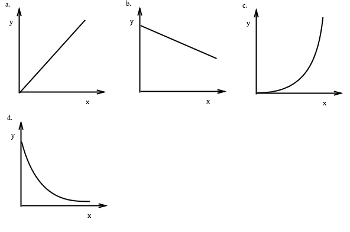

--- 
title: Physics 1
layout: default
--- 
# Physics 1

1. Two resistors in parallel have a combined resistance given by the equation: 

    $$ \frac{1}{R_{total}} = \frac{1}{R_1} + \frac{1}{R_2} $$ 

    1.   Show algebraically that this can be re-written to give the expression (known as the 	“the product over the sum”):
    $$ R_{total} = \frac{R_1 R_2}{R_1 + R_2} $$

    2. It is suggested this “product over sum” rule may be extended to three resistors as follows:
    $$ R_{total} = \frac{R_1 R_2 R_3}{R_1 + R_2 + R_3} $$
    *Without using algebra* describe whether or not you think this is likely to be correct.

3. Below is a list of distances:
    * 150 million kilometers
    * 650 nanometres
    * 1\.3 Angstrom
    * 12,800 km
    * 2\.5 nm
    * 10 µm
	
	1. Re-write each of these distances in standard form to three significant figures.
	2. Next to each distance write which of the following most matches the scale:
		* A wavelength of visible light
		* The diameter of the earth
		* The diameter of an atom
		* The size of a transistor in a computer
		* The width of a fibre in your jacket
		* The distance from the earth to the sun

2. Over the course of an hour a car averages 40.2 miles per gallon (mpg).  By considering the units or otherwise convert this value to litres per 100 km.  *(1 gallon = 4.55 litres; 1 mile = 1.6 km)*
	
1. In each of the following graphs, describe how the *y* value changes as the *x* value increases.  You should consider the change in *value* and the change in *rate*.

	
	
1. For each of the graphs above, give and example of two quantities which are related in this way.
