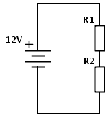
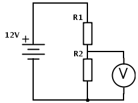
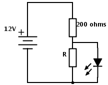
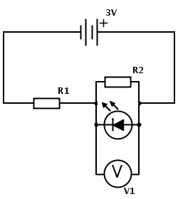
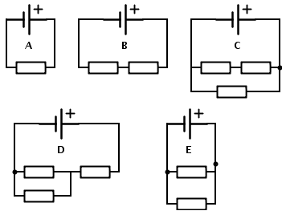

1. &nbsp;

	1.A simple potential divider circuit is made as shown below.
	
	The resistances of R1 and R2 are both 10 k&Omega;.
		1. Show that the curernt through the circuit is 0.6 mA.
		2. Calculate the potential difference across the bottom resistor, R2.

	1. A voltmeter is now added in parallel with the bottom resistor. The reading on the voltmeter is only 5.5 volts, less than the expected value. This is because the voltmeter has a finite resistance and therefore some current flows through the voltmeter.
	
		1. Calculate the potential difference across the top resistor (R1) with the voltmeter connected.
		1. Hence, calculate the current flowing through R1.
		1. Calculate the current through R2.
		1. Hence, calculate the resistance of the voltmeter.
	1. A similar potential divider is now used to provide the correct voltage for an LED (Light 
	Emitting Diode) although the resistors have lower values and the resistors are not the same 
as each other.
	
	If the LED requires an operating voltage of 2 volts and a current of 20 mA, calculate a suitable 
value for the unknown resistor R.

1. &nbsp; 
	
	The LED has a potential difference across it of 0.6 V and R1 and R2 have resistances of 2 k&Omega; and 5 k&Omega; respectively.  Calculate:
	1. The current through R2.
	1. The current through, and potential difference across, R1. 
    1. Hence, calculate the current through the LED (assume the voltmeter has infinite resistance).

1. The circuits below all contain combinations of a 1.5 V cell and 10 &Omega; resistors.  In which circuit is the greatest power dissipated? Explain your reasoning.
	
	
