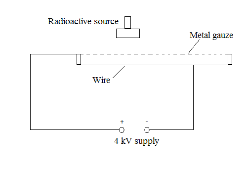
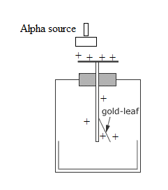
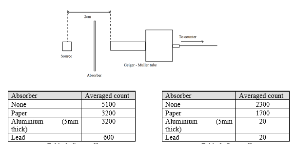

For this exercise you may need a periodic table.  If you are online try [WebElements](http://www.webelements.com/).

1. The image below shows a spark counter. When a radioactive source is brought near, sparks are produced in the gap between the gauze and the wire.
    
    1. Explain what the radiation does to produce these sparks.
    2. The source is moved about 5cm above the gauze and the sparking stops. Explain what you can conclude about the type of radiation.

1. An alpha source is held near to a positively charged electroscope (shown below). The leaf falls. Explain why.
    

1. You are presented with two sources, X and Y. These sources might emit more than one type of radiation. Each source is place in front of a Geiger-Muller tube, and then various absorbers are placed in front of the source. Tables 1 and 2 show the counts taken over a 100-second period. 
    
    Work out which types of radiation are emitted by each source

1. Copy and complete the following examples of radioactive decay to include the nucleon and proton numbers of the daughter nucleus.
    

1. Neptunium-240 decays to Actinium-228 by a series of emissions of alpha and beta particles.  How many of each were emitted?

1. It is suggested that some particles may decay by double beta decay, i.e. emitting two beta particles simultaneously.  An example is give below. Copy and complete the equation to include the missing nucleon and proton numbers.
    
